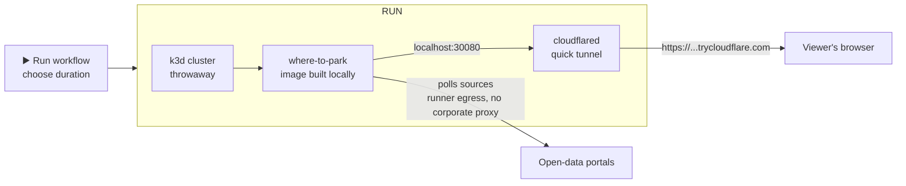

# where-to-park

[](https://github.com/cui-zheng-1128/where-to-park/actions/workflows/build-test-publish.yml)

Nearby parking discovery API over public open-data portals. Multi-city, multi-source. Spring Boot 4.1.1 on Java 17, Maven multi-module. Read-only: only `GET` is mapped; every other method returns `405`.

## Build and run

```powershell
mvn clean package          # builds and runs unit tests
java -Dfile.encoding=UTF-8 -jar where-to-park-rest/target/where-to-park-rest-0.0.1-SNAPSHOT.jar
```

> Windows note: if the folder path contains CJK characters, start with `-Dfile.encoding=UTF-8` and run from the jar's directory. If the network intercepts TLS with an unknown CA, add `-Djavax.net.ssl.trustStoreType=WINDOWS-ROOT` or HTTPS ingestion fails.

Production runs with `--spring.profiles.active=prd`. A multi-stage `Dockerfile` (dependency cache warm-up, non-root runtime) is provided, and the `bruno/` collection covers the live checks: per-city queries, cross-city isolation, freshness, and the error contract.

## Running the container manually (no K8s)

For a quick local check without any cluster:

```powershell
docker build -t where-to-park:local .
docker run --rm -p 8080:8080 where-to-park:local
curl http://localhost:8080/actuator/health
```

On a corporate network whose proxy intercepts TLS, ingestion will fail with `PKIX path building failed`; the container then needs a truststore that also trusts the intercepting chain (capture it with `openssl s_client -showcerts`, append the chain anchor to a copy of the JVM default cacerts, mount it, and point `-Djavax.net.ssl.trustStore` at it). The sandbox avoids this entirely by running on the runner's open egress.

## Deployment

The demo is designed to run **ephemerally** — spun up on demand, shown, then destroyed. Everything runs inside a GitHub Actions runner; the viewer only needs a browser.

### Demo sandbox (GitHub Actions)

[.github/workflows/demo-sandbox.yml](.github/workflows/demo-sandbox.yml) is manually triggered. It starts a throwaway K8s cluster **on the runner itself**, builds the image locally, deploys [_k8s/deployment.yaml](_k8s/deployment.yaml), and exposes the service through a free Cloudflare quick tunnel.



How to use it:

1. Actions tab → **▶️ Demo Sandbox** → **Run workflow** → pick a duration (15–60 min).
2. Open the running workflow → the step summary shows the public URL and ready-made links:
   - `$URL/swagger-ui.html` — interactive API
   - `$URL/v1/cities` — per-city freshness
   - `$URL/v1/parkings/nearby?lat=46.5802&lon=0.3404&radius=2000&limit=10` — live Poitiers data
3. The tunnel and cluster die automatically when the run ends (timeout or cancel).

Why this shape:

- **No corporate proxy in the way.** The runner's egress reaches the data portals directly; a demo shown on an interviewer machine that itself sits behind TLS interception still works.
- **Nothing to install for the viewer.** Only the person triggering needs write access or a fork; the audience only opens a URL.
- **Nothing leaks past the session.** No persistent host, no leftover cloud resources — the runner is destroyed with the workflow run.
- **The manifest stays honest.** [_k8s/deployment.yaml](_k8s/deployment.yaml) is plain single-replica + NodePort; the sandbox consumes it unchanged, so "deploys on standard K8s" remains demonstrably true.

Notes:

- The `build-test-publish` workflow's contract tests (bruno) still run on every push; the sandbox is additive and only runs when manually triggered.
- The quick-tunnel hostname is random per run (e.g. `https://abc-def.trycloudflare.com`) and is surfaced in the step summary — this is intentional for an ephemeral demo.
- The runner's 2 vCPU / 7 GB comfortably fits this app; startup to live data takes ~2–3 minutes (image build + k3d + first ingestion cycle).
- A read-only reviewer cannot press **Run workflow**: `workflow_dispatch` requires write access to the repository. The equivalent path is a fork — [fork the repository](https://github.com/cui-zheng-1128/where-to-park/fork), enable the workflows when GitHub asks, and trigger **▶️ Demo Sandbox** from the fork's Actions tab; the sandbox uses no secrets, so the fork run is identical, and GitHub-hosted runners are free for public repositories.
- The step summary of any run, including the live URL inside it, can be opened by anyone while the run is up, so a demo can also be shared as a plain link.

### Verifying a sandbox run

Watch the steps go green, then verify the URLs from the step summary. A validated run stays in the Actions history: [Demo Sandbox, 2026-10-05](https://github.com/cui-zheng-1128/where-to-park/actions/runs/37359742483) — all steps green, live data for the five configured cities.

| Check | Link | Expected |
|---|---|---|
| Health | `$URL/actuator/health` | `{"status":"UP"}` |
| Freshness | `$URL/v1/cities` | every city `"fresh": true`, non-zero `parkingCount` |
| Realtime data | `$URL/v1/parkings/nearby?lat=46.5802&lon=0.3404&radius=2000&limit=10` | non-empty `results`; Poitiers entries carry `availableSpots` and `status: "OPEN"` |
| Static semantics | `$URL/v1/parkings/nearby?lat=48.8566&lon=2.3522&radius=2000` | `availableSpots: null`, `status: "UNKNOWN"`, `capacity` present |
| Interactive API | `$URL/swagger-ui.html` | redirects to `/swagger-ui/index.html`; endpoints and schemas render |

Command-line equivalent:

```bash
URL=<public url from the step summary>
curl -s "$URL/v1/cities"
curl -s "$URL/v1/parkings/nearby?lat=46.5802&lon=0.3404&radius=2000&limit=10"
curl -s -o /dev/null -w '%{http_code}\n' "$URL/v1/parkings/nearby?lat=999&lon=0"                # 400, validation contract
curl -s -o /dev/null -w '%{http_code}\n' -X POST "$URL/v1/parkings/nearby?lat=46.58&lon=0.34"   # 405, read-only contract
```

The same `bruno/` suite CI runs can be replayed against the tunnel (Bruno CLI required, see [bruno/README.md](bruno/README.md)):

```bash
cd bruno
bru run --env local --env-var "baseUrl=$URL"
```

Interpretation notes:

- `sourceUpdatedAt` is echoed from each source as-is; judge freshness from `/v1/cities` rather than computing exact ages (source-side timestamp skew is covered under Known limitations).
- If `Wait for first ingestion cycle` prints nothing and the links return empty `results` while `/v1/cities` shows `"fresh": false`, the runner could not reach that portal (blocked or rate-limited); the API keeps serving its last snapshot by design.
- To finish early, press **Cancel workflow** on the run page.

## Architecture

The system is two independent paths joined by a store, so a request never touches an external source and a broken source never touches a request:

```
Write path (polling ingestion, each source on its own schedule):

  city portal ──▶ connector ──▶ ParkingStore.replaceAll ──▶ H2 ┬─ parking (latest snapshot)
  (Data Fair,    (normalize,    (write port, atomic          └─ parking_availability_history
   Opendatasoft)  validate)      per city)
       ▲
       └── IngestionScheduler: per-connector interval, back-off, in-flight guard

Read path (serves only what the store holds):

  client ──GET──▶ controller ──▶ service ──▶ ParkingRepository ──▶ H2
                                  (haversine scan, rank, limit)
```

Four decisions shape everything else:

- **Ports and adapters.** Business code depends on two interfaces, `ParkingRepository` (read) and `ParkingStore` (write), and knows nothing about storage. H2/JPA is the current adapter, selected by `@ConditionalOnProperty`; Redis GEO or PostGIS can replace it without touching the service or the scheduler.
- **Canonical model as anti-corruption boundary.** The `Parking` record is the only type that crosses between paths. Source-specific field names, units, and coordinate reference systems never leak past the connectors.
- **Configuration-driven cities.** Adding a city is a YAML entry under `parking.sources`; adding a platform is one connector class. Neither the scheduler nor the query code changes.
- **Stale serving on failure.** A failing connector only logs and backs off; the store keeps serving the last good snapshot. The outage surfaces to operators through metrics, never to clients as an error.

## Module: where-to-park-connector

Framework-free ingestion library (plain Java, no Spring): the SPI, the canonical model, and one connector per source platform.

| Package | Role |
|---|---|
| `model` | Canonical domain: `Parking` (record, mandatory fields non-null), `Location` (WGS84, range-checked), `ParkingStatus`. |
| `connector` | SPI and ports: `ParkingSourceConnector` (one implementation per city/platform), `ParkingStore` (write port), `ConnectorRegistry` (immutable carrier, the scheduler's single injection point), `AbstractHttpSourceConnector` (template-method base). |
| `connector.datafair` | Data Fair platform (Koumoul), e.g. Grand Poitiers. Fixed French field names. |
| `connector.opendatasoft` | Opendatasoft platform. Field mapping is a configuration record, because every city names its columns differently. |

Design notes:

- **Template method.** `AbstractHttpSourceConnector` owns the cross-cutting concerns once: paged GET (100 records per page, 50-page safety bound), timeouts (5 s connect, 10 s request), gzip decoding (sniffs the magic bytes for responses that omit `Content-Encoding`), and per-record fault tolerance (a malformed record is dropped with a warning; the page survives). A subclass only maps one record to a `Parking`.
- **Completeness check.** A fetch that collects fewer records than the source advertises fails outright: serving the previous snapshot beats silently dropping parkings.
- **Never guess semantics.** `availableSpots` keeps `null` (unknown) distinct from `0` (full). Status conventions are explicit per source: `FULL` only when an occupancy rate confirms it; Opendatasoft's occupancy-dependent codes resolve through the declared `OPEN_OR_FULL` mapping; without a declared mapping, every record reports `UNKNOWN`.
- **Namespaced ids.** Every id is `cityId:sourceId` (e.g. `poitiers:1`), globally unique, so `GET /v1/parkings/{id}` needs no city parameter.
- **The write port lives here.** `ParkingStore` sits in this module, not the runtime one, because "city snapshot" is an ingestion concept; the rest module provides the implementation.

## Module: where-to-park-rest

Spring Boot runtime: the REST API, the polling scheduler, the storage adapter, and all Spring wiring.

| Package | Role |
|---|---|
| `controller` | `ParkingController` (`/v1/parkings`), `CityController` (`/v1/cities`); bean validation on query parameters. |
| `controller.exception` | `@ControllerAdvice` mapping each failure class to its status; `ErrorResponse { status, message, timestamp, path }`. Status contract: 200 / 304 / 400 / 405 / 429 / 500. |
| `service` + `service.impl` | `ParkingService` interface; `ParkingServiceImpl` runs the in-memory haversine scan, ranking, and limiting. |
| `service.model` | `Ranking` (DISTANCE / AVAILABILITY / DRIVE_TIME), `ScoredParking`, `SearchResult`. |
| `repository` + `repository.jpa` | `ParkingRepository` read port; `H2ParkingRepository` implements both ports over JPA/H2. |
| `dto` + `mapper` | JSON contract (`NearbyParkingsResponse` envelope, `ParkingDTO`, `CityDTO`, `AttributionDTO`); MapStruct mapper. |
| `ingestion` | `IngestionScheduler` (polling engine), `IngestionMetrics` (per-city staleness gauges), `HistoryRetentionJob` (nightly purge). |
| `configuration` | Bean wiring: connectors from YAML, injected `Clock`, CORS/formatters/rate-limit filter, OpenAPI. |

### Ingestion engine

`IngestionScheduler` polls each connector at most once per its own `poll-interval`, on a bounded pool (`parking.ingestion.parallelism`, default 4), so one slow city never delays the others. Failures trigger exponential back-off (30 s, doubling, capped at `parking.ingestion.max-backoff`, default 5 min).

- **In-flight guard.** A city whose previous fetch is still running is skipped: two overlapping `replaceAll` transactions can never let the older snapshot win.
- **Warm-up.** The first poll fires on `ApplicationReadyEvent`, so the store is populated before traffic arrives.
- **Observable staleness.** Two gauges per city, `parking_ingestion_last_success_timestamp` and `parking_ingestion_stale_seconds`, expose source outages and served-data age on `/actuator/prometheus` for alerting. `GET /v1/cities` reports a city as fresh when the last success is within two poll intervals (one missed refresh tolerated).

### Query path

- **Haversine in memory.** Distances use the haversine formula (mean Earth radius, ~0.5% error, acceptable for the 5 km maximum radius) over a full snapshot scan. The repository port hides this, so a geo-indexed store can replace it when volume outgrows the scan.
- **Stable sort.** Comparators chain ranking key, then distance, then availability, then id: the order is deterministic across requests.
- **Honest ranking.** `DRIVE_TIME` degrades to `DISTANCE` until a routing engine exists; the response reports both `rankingRequested` and `rankingApplied`, so it never lies about the sort.
- **Atomic replace.** `replaceAll` deletes and reinserts a city inside one transaction and appends the occupancy observation to `parking_availability_history` in the same transaction: readers never see a half-replaced city, and the forecasting time series is built for free.

### HTTP contract

- **Read-only.** Only `GET` is mapped; other methods return `405` with an `Allow` header (RFC 9110). CORS allows cross-origin `GET` from any origin (public data, no credentials).
- **Envelope response.** `NearbyParkingsResponse` is an object, not a bare array: fields can only be added, never removed, so existing clients keep working.
- **ETag as data version.** The ETag hashes every served field of every result; a matching `If-None-Match` gets `304` with no body. `Cache-Control: max-age=30, stale-while-revalidate=30`, where 30 s is half the shortest source refresh (60 s).
- **Rate limiting.** Fixed window per client IP (first `X-Forwarded-For` hop when proxied), `429` plus `Retry-After` when exceeded, lazily evicted bounded map. In-memory is deliberate: it matches the per-replica H2 store.
- **Attribution.** Legally mandatory and enforced at bind time (`@NotNull` in configuration); a response credits only the cities actually present in its results.
- **Testable time.** The ingestion pipeline takes an injected `Clock` bean instead of calling `Instant.now()`, so staleness and back-off logic run against a fixed clock in tests.

### Persistence

- **Schema owned by Flyway** (`db/migration`); Hibernate `ddl-auto` is `none`.
- **Two tables:** `parking` (latest snapshot, with `fetched_at` for staleness tracking) and `parking_availability_history` (one row per parking per fetch, the time series for availability forecasting). `HistoryRetentionJob` purges history older than 30 days nightly.
- **Embedded H2 2.4.240** (version resolved from the Spring Boot 4.1.1 BOM; the POM declares `com.h2database:h2` without a version). File mode in dev (survives restarts, zero-ops); in-memory under the `prd` profile, because every demo deployment target (K8s `emptyDir`, Render) discards files on redeploy anyway — file mode would only add `AUTO_SERVER` lock failure modes. Live data self-heals within two poll cycles; only the history table is lost on restart, and the Roadmap covers its long-term home. The H2 console is dev-only; the `prd` profile turns it off.

Why a relational store:

- **Relational by nature.** Parkings belong to cities, and availability is a time series keyed by parking and fetch time; keys, indexes and `GROUP BY` cover the access patterns without denormalisation or application-side joins.
- **ACID fits the snapshot swap.** The delete-and-reinsert refresh must be atomic, and the engine guarantees it natively.
- **An explicit schema is a contract.** Every shape change is a reviewed migration, and ingestion-time validation removes the need for schema-less flexibility.
- **Portability, not lock-in.** Everything runs through JPA over a standard JDBC driver, and the baseline migration sticks to plain DDL (string keys, no identity columns, standard timestamp types).

Upgrade path — the API does not change; each engine adds a repository adapter and a dialect migration set:

| Engine | Why it would be picked | What changes |
|---|---|---|
| PostgreSQL + PostGIS | First step for scale: GiST spatial index for `nearby`, durable storage | new repository adapter; the in-memory scan becomes indexed SQL |
| MySQL / MariaDB | Ops familiarity; spatial types with SRID 4326 | dialect migration set |
| SQL Server / Oracle | Existing enterprise licences | dialect migration set; JPA/JDBC parity |
| TimescaleDB | Availability history becomes the dominant data volume | PostgreSQL extension; compression and time-bucketed queries |

Redis GEO remains the read-side scale-out option from the Roadmap — a snapshot cache for fast geo lookups, with a relational engine as the system of record.

## API

```
GET /v1/parkings/nearby?lat=46.5838&lon=0.3378&radius=1000&limit=20&ranking=DISTANCE
```

| Param | Type | Required | Default | Range |
|---|---|---|---|---|
| `lat` | double | yes | — | [-90, 90] |
| `lon` | double | yes | — | [-180, 180] |
| `radius` | int (m) | no | 1000 | [50, 5000] |
| `limit` | int | no | 20 | [1, 100] |
| `ranking` | enum | no | DISTANCE | DISTANCE / AVAILABILITY / DRIVE_TIME |

Contract: envelope response; distances in meters; WGS84; ISO-8601 UTC; stable sort. `availableSpots` is `0` for full, `null` when the source provides no figure. Errors carry `ErrorResponse { status, message, timestamp, path }`.

Example (`/v1/parkings/nearby?lat=46.5802&lon=0.3404&radius=1000&limit=1`):

```json
{
  "rankingRequested": "DISTANCE",
  "rankingApplied": "DISTANCE",
  "results": [
    {
      "id": "poitiers:2",
      "name": "HOTEL DE VILLE",
      "location": { "lat": 46.5793, "lon": 0.3386 },
      "distanceMeters": 172,
      "capacity": 625,
      "availableSpots": 374,
      "driveSeconds": null,
      "status": "OPEN",
      "sourceUpdatedAt": "2026-10-05T21:49:58Z",
      "fetchedAt": "2026-10-05T21:50:06Z",
      "cityId": "poitiers"
    }
  ],
  "attribution": [
    {
      "cityId": "poitiers",
      "source": "Grand Poitiers - open data",
      "license": "Licence Ouverte / Open Licence 2.0",
      "url": "https://data.grandpoitiers.fr/datasets/mobilites-stationnement-des-parkings-en-temps-reel"
    }
  ]
}
```

| Endpoint | Purpose |
|---|---|
| `GET /v1/parkings/nearby` | Nearby search (above). |
| `GET /v1/parkings/{id}` | One parking by id (e.g. `poitiers:1`). |
| `GET /v1/cities` | Supported cities: attribution, parking count, data freshness. |
| `GET /actuator/health` | Liveness/readiness probes. |
| `GET /actuator/prometheus` | Metrics for scraping (ingestion freshness per city). |
| `GET /swagger-ui.html` | OpenAPI UI (spec at `/v3/api-docs`). |

## Limitations and roadmap

Deliberate scope decisions:

- **No authentication and no write endpoints.** The API serves public open data and maps only `GET`; CORS is `*` for `GET /v1/**` only.
- **Single instance, no high availability.** H2 (file in dev, in-memory under the `prd` profile) is local to the process, so a second replica would not share state.
- **In-memory nearby scan.** Haversine over every parking is `O(n)`: comfortable for five cities (~200 parkings).
- **No pagination.** `limit` (max 100) plus the bounded `radius` keeps payloads small.
- **`DRIVE_TIME` degrades to `DISTANCE`** until a routing engine exists, and every response declares it (`rankingRequested` vs `rankingApplied`).

Constraints from the domain, not from scope:

- **Poll-based ingestion.** Freshness equals each source's poll interval (60 s realtime, 5 min static); the portals offer no push or webhook feeds to consume.
- **Rate limiting is per-instance and fixed-window.** Keys are client IPs (first `X-Forwarded-For` hop when proxied) and the window state is in-memory, which matches the per-replica store; a fleet-wide quota needs a shared counter such as Redis.
- **Source quirks pass through unmodified.** Some portals publish timestamps slightly ahead of wall-clock time (observed on Data Fair), and static datasets carry no availability feed at all (`availableSpots: null`).

Roadmap:

- Scale out to Redis GEO or PostGIS behind `ParkingRepository` when volume outgrows the in-memory scan, which also unblocks a second replica.
- ArcGIS and DATEX II connectors; real `DRIVE_TIME` ranking with traffic; DEM elevation enrichment for mountainous cities.
- Not started: load/SLO tests, tracing (OpenTelemetry), message i18n.

## Time spent

About 13 hours of focused work, spread across one week of evenings and weekends: design, connectors and ingestion, the REST layer and its tests, CI, the demo sandbox, and this documentation.
